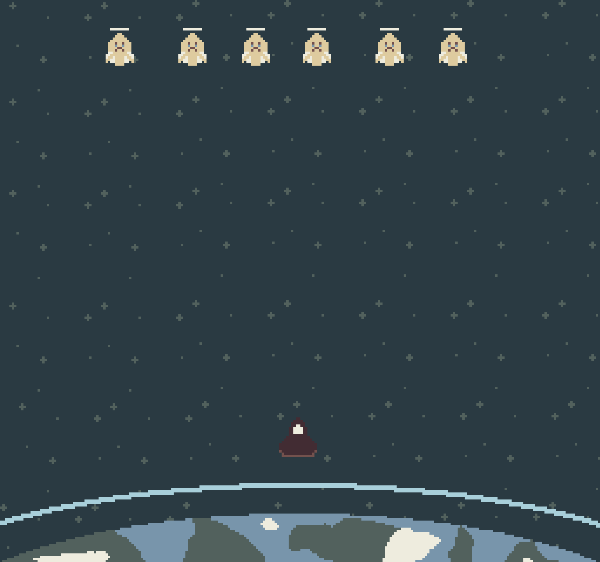

## Concept

A 2D Space Invaders clone. The player must defeat all invaders before losing all their lives or Earth sustaining too much damage.

The fewer enemies that remain, the faster the formation moves

## Main Mechanics - Mechanics and Gameplay loop

# Player

- The player moves horizontally and shoots missile up at the alien formation.
- Player missiles can delete enemy bullets
- The Player can only have 1 missile in the screen at the same time, only being able to fire when its projectile is gone.
- The player dies in one hit.
- The player has 3 lives.
- When losing a life, the game pauses for a short moment before continuing.

# Enemies
- There are 3 enemies types. With the only difference being the sprites. Besides that, they are fundamentally the same.
- All enemies die in one hit.
- The aliens move in a formation. The formation moves from side to side, moving downwards when it reaches the edge of the screen, and then reversing direction. (goes right -> all lines move down -> goes left...)
- Enemies give points when dying.
- An enemy can only shoot when there is no other enemy directly lower than it.

# Boss

The final boss is significantly different from the normal enemies.

- The boss moves freely rather than following the alien formation's grid-based movement.
- The boss has a health bar and requires multiple hits to defeat.
- The boss can shoot from multiple parts of its body.
- The boss may bleed when damaged.
- The boss may have a more realistic art style compared to the normal enemies.

# Win Condition

- The player kill all aliens and defeat the final boss.

# Lose Condition

- The player loses all lifes
- An alien reach the Earth 2 times (once on shield, once directly)

# Core Gameplay Loop

Move -> Aim -> Shoot -> Protect Earth shooting at bullets -> Kill enemies -> Formation moves faster -> Repeat

The game will be divided in 3 waves of invaders, with a dialog between each. The player gets healed after every wave.

The first wave will function as a tutorial, with a smaller number of enemies that move and shoot slower. The starting dialog will give a little exposure to the player about who they are and why they're fighting, and explain game mechanics with a in universe explanation (as in, "Remember, your ship can only take about 3 shots before exploding", etc.) 

The second wave should have a medium/normal difficulty.

The third wave will be a lot more aggressive, and the enemies will have an extra frame of animation, showing a distorted form (maybe only show this form with no move animation or only show this frame on death, idk). 

After the final wave, a boss appears. Both the player and the boss fly away from Earth, removing the need to protect it, making it a duel only. The player will shoot and move normally but the boss will instead have attack patterns with warning indicators, changing the normal gameplay. Would be sick to have a dope ass soundtrack and A LOT of visual effect. Like, really make it over the top and intense. Also, the dialog character that speaks with the player will be completely clueless and panicked when speaking to the player before the fight.

## Visual / Audio Style

Simple pixel art, soft and moody. Drawn by me.

Enemies have biblical inspirations. As in being sad aliens invading Earth. Each enemy has only 2 sprites that toggle when moving.

Audio should be retro arcades inspired, with a anxiety (when faster) inducing sound accompanying the movement of the alien formation.

The last enemy will be a boss portraying a biblically accurate alien with realistic art style maybe.

## Story

Humanity has been being attacked (being invaded) by aliens for quite some time now. War has brought death and destruction, but humanity managed to push them back with great sacrifices.

The player is the only one left capable of fighting the last invasion attempt. Also, the aliens are crying and we don't know why.

The last enemy will be a boss portraying a biblically accurate alien with realistic art style maybe.

## Timeline

Dialog appears -> "we are all counting on you or something" -> aliens appear -> fight! -> player kills 3 waves -> Boss appears, ominous music -> idk.

## Other

Boss roars
Would be dope if there is some help in the boss, like, the Earth is shoot because you didn't manage to protect it but then a dialog appears just before the Earth is hit and saves you or something. Music changes, etc.
I will use Dialogic 2 for dialogs.

Formation {Base Enemy > Unique Enemy.}
Formation controls the enemy position and if its allowed to fire.
